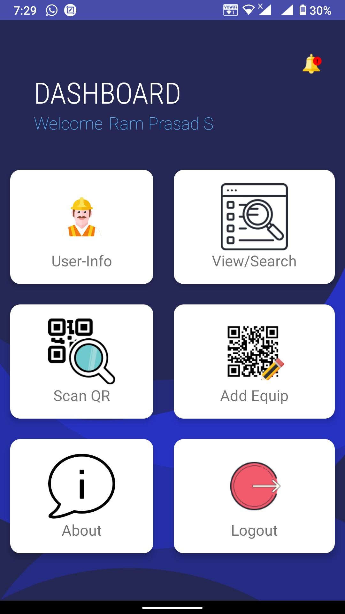

# Equipment_Report_Manager
Equipment Report Manager is an android application, designed specifically for industries and organisations (say Airports Authority of India) that rely more on machines and tools. It can be used by the industries to scan QR code pasted on an equipment and get to know about its details like, Manufacture details, Machine Batch Codes, Past Service Record, Repair and Service information, Next Service Date, Service Remarks, etc. by using Scan QR Option. The Create or Update QR Option is used to add or update service details of an equipment. It also has other functions like View/Search option and Notification bar.

For Copyright purpose I didn't posted the code. For code contact me at
Mail-Id - prasad814359@gmail.com
Mobile -  +91 8072909614

